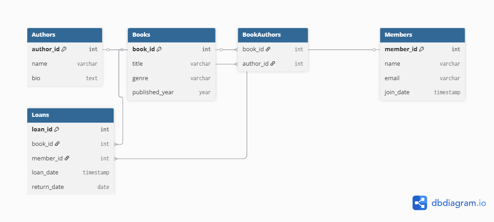

# 📚 Library Management System

This project implements a **relational database schema** for a Library Management System using **MySQL**.  
It manages **books, authors, members, and book loans** with proper constraints and relationships.

---

## 📂 Database Details

**Database Name:** `LibraryDB`

### Tables
- **Authors** – Stores author details.  
- **Books** – Stores book details.  
- **BookAuthors** – Junction table for the Many-to-Many relationship between Books and Authors.  
- **Members** – Stores library member details.  
- **Loans** – Tracks book borrowings by members.  

---

## 🔗 Relationships

- **One-to-Many:**
  - A Member can borrow many Books → (`Members → Loans`).  
  - A Book can be borrowed many times → (`Books → Loans`).  

- **Many-to-Many:**
  - A Book can have multiple Authors, and an Author can write multiple Books → handled via `BookAuthors`.  

### Constraints
- **PRIMARY KEY** – Uniquely identifies each record.  
- **FOREIGN KEY** – Enforces referential integrity.  
- **NOT NULL** – Ensures required fields are always filled.  
- **UNIQUE** – Prevents duplicate entries (e.g., email, book title + year).  

---

## 📊 ERD Diagram

---

🚀 How to Run

Open MySQL Workbench, XAMPP, or your preferred MySQL client.

Create and switch to the database:

CREATE DATABASE IF NOT EXISTS LibraryDB;
USE LibraryDB;

Run the SQL script (library_schema.sql) to create tables and insert sample data.

Verify the tables:

SHOW TABLES;

✅ Example Queries

Get all books borrowed by a specific member:

SELECT m.name, b.title, l.loan_date, l.return_date
FROM Loans l
JOIN Members m ON l.member_id = m.member_id
JOIN Books b ON l.book_id = b.book_id
WHERE m.name = 'Joan Mugure';

Find all authors of a specific book:

SELECT b.title, a.name
FROM BookAuthors ba
JOIN Books b ON ba.book_id = b.book_id
JOIN Authors a ON ba.author_id = a.author_id
WHERE b.title = 'The River Between';

🌐 Deployment Options

You can host and use this schema on:

Local MySQL Servers (XAMPP, WAMP, MAMP).

Cloud Databases (AWS RDS, Azure MySQL, Google Cloud SQL).

As part of an application backend (Node.js, Django, Spring Boot, Flask, FastAPI).